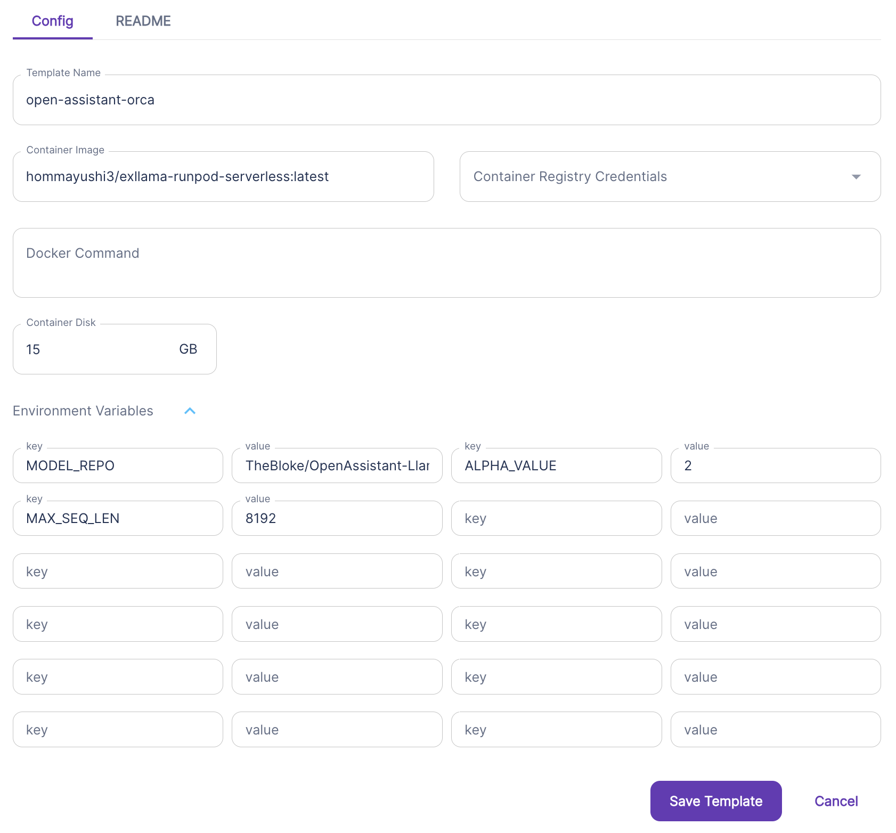
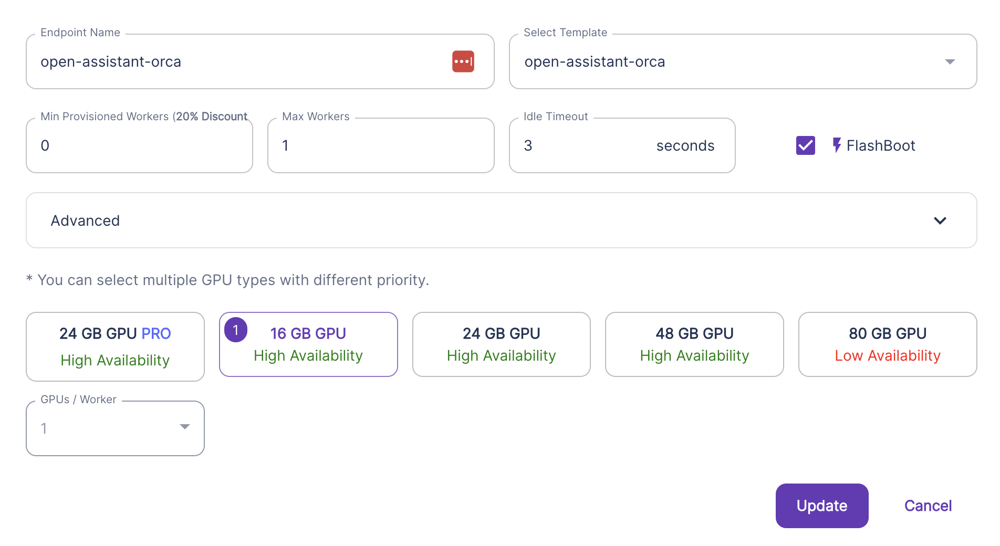

# runpod-llm-slackbot
This project uses RunPod to serve LLMs using [this Docker image](https://github.com/hommayushi3/exllama-runpod-serverless), AWS Lambdas to orchestrate, and Slack Apps for the UI layer.

## RunPod Endpoint Setup
### Runpod Serverless Endpoint Template Configuration

### Runpod Serverless Endpoint Configuration

## AWS Lambdas Setup

## Slack App Setup

